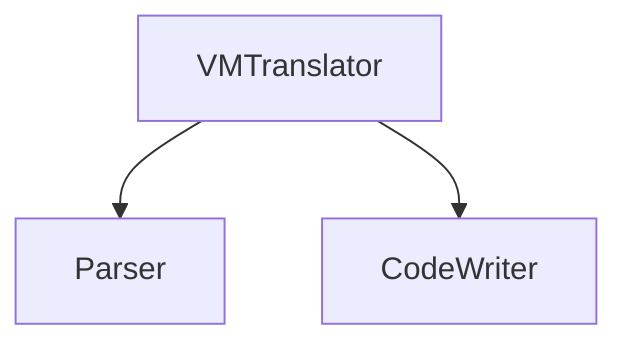

# Modules


```mermaid
graph TD
    VMTranslator --> Parser
    VMTranslator --> CodeWriter
```

# Usage

```bash
python VMTranslator.py <filename>.vm
# OR
python VMTranslator.py <folder_containing_VM_files>
```
